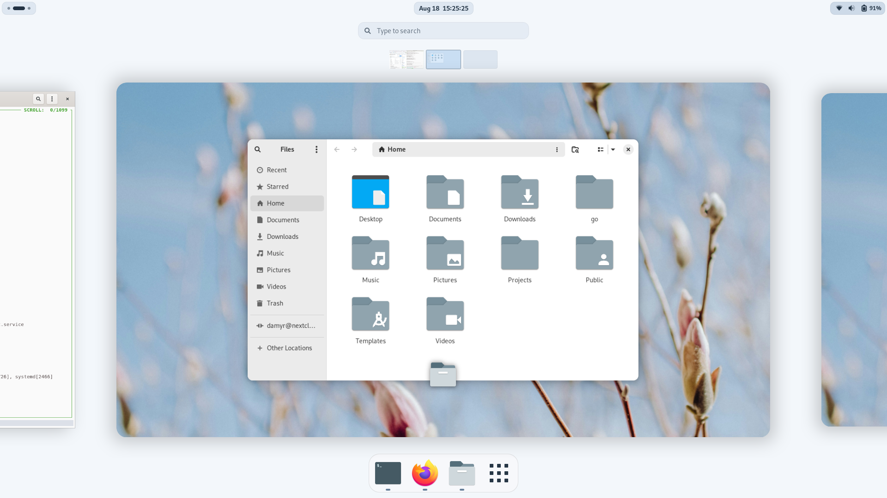

# My system configuration

This repository contains my personal desktop and laptop configurations, showcasing a clean and efficient setup for development and daily use.

## 📸 Screenshots




## 🛠️ Setup Details

- **Operating System**: Debian Testing 🍥
- **Desktop Environment**: GNOME
- **Theme**: Light theme [Marble](https://github.com/imarkoff/Marble-shell-theme)

## 🧰 Development Tools

- **Text Editor**: [Neovim](https://www.damyr.fr/posts/neovim/)
- **Terminal Multiplexer**: [Zellij](https://www.damyr.fr/posts/zellij/)
- **Web Browser**: Firefox (not ESR)
- **Secret manager**: [Pass](https://www.damyr.fr/posts/passwordmanager/)

## 📁 Repository Structure

All my configuration is split on 6 Ansible roles, and somes pre steps on Makefile.

```
├── computer.yml # main Ansible playbook
├── LICENSE
├── Makefile # Makefile with first steps and shortcut for Ansible Tags
├── README.md # <--- You are here 
├── requirements.txt
├── requirements.yml
├── roles
│   ├── dotfiles # Managing all dotfiles conf (Neovim is clone from another Github project)
│   ├── gnome # Setup all my Gnome, theme and stuff
│   ├── packages # Install all my tools with apt and asdf
│   ├── security # some specific parameters
│   ├── system # Global settings
│   └── user # Manage user and stuff
└── vars
    ├── packages.yml
    ├── system.yml
    └── user.yml
```

## 🚀 My process

1. Install base:
   ```
   apt update && apt -y install git
   ```
1. Clone this repository:
   ```
   git clone git@github.com:DamyrFr/ansible-personal-computer.git
   ```
3. Run all
   ```
   make firstrun
   ```

## 🔗 Related Projects

- [My Neovim Configuration](https://github.com/yourusername/neovim-config): A separate repository containing all my Neovim configuration files and plugins.
- [My NixOS configuration](https://github.com/DamyrFr/MyNixOSConfig) : I have a NixOS system, and I have start to migrate this on Nix so you will find a part of all this on it.

## 📄 License

Big thanks to [Kelly Sikkema](https://unsplash.com/fr/@kellysikkema) for the [wallpaper](https://unsplash.com/fr/photos/boutons-floraux-roses-dans-une-lentille-a-bascule-Gxzgc6OJjlo).

This project is licensed under the MIT License - see the [LICENSE](LICENSE) file for details. Feel free to use it, not all is perfect, but work pretty well.
